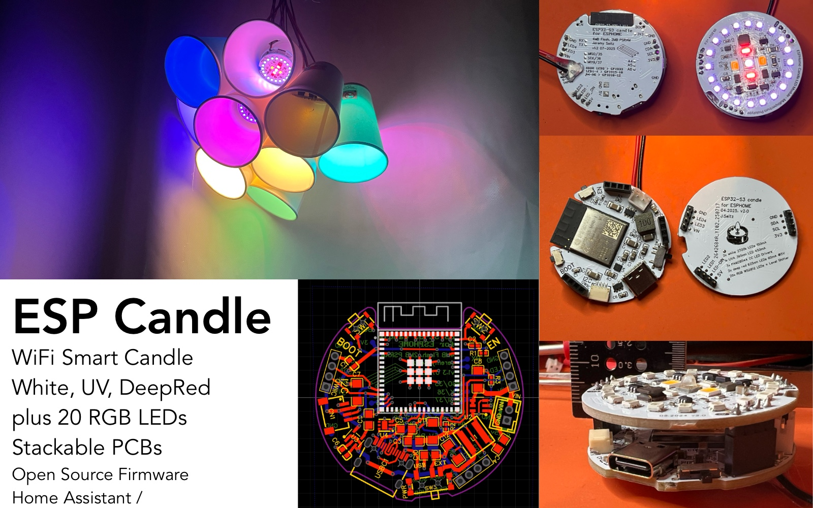

# Pixel Theater

> [!IMPORTANT]
> We will be at [Why2025](https://why2025.org) with kits and hands-on hacking from August 7-12, 2025. See our [event wiki page](https://wiki.why2025.org/Village:Pixel_Theater) for details.

PixelTheater is a platform for creating interactive LED animations on different shaped models constructed from PCBs.

## Software

PixelTheater's main open-source firmware project is [DodecaRGB-firmware](https://github.com/Pixel-Theater/DodecaRGB-firmware), which powers the DodecaRGB LED model and provides tools for animation, hardware integration, and development. In additionl to the 3d led models, we also have clocks, message blocks and other projects. 

## LED Models

### DodecaRGB v2.2

The DodecaRGB is a 12-sided electronic sculpture featuring 1,620 addressable RGB LEDs, creating stunning light animations. Powered by a Teensy 4.1 microcontroller and the PixelTheater library ([GitHub](https://github.com/PixelTheater/DodecaRGB-firmware)), it's portable and battery-operated with integrated power management and charging. This kit contains the custom control board that handles power, LED control, sensors, and user interaction.

### DodecaRGB Cube v1.0

Coming soon

### Icosododecahedron v1.0

The Icosododecahedron is a 20-sided electronic sculpture featuring 2,300 addressable RGB LEDs - 12 pentagons and 20 triangles, an insane amount of LEDs. Powered by a Teensy 4.1 microcontroller and the PixelTheater library ([GitHub](https://github.com/pixeltheater/)), it's can be used with the same hardware as the DodecaRGB v2.2. 

## Other Projects and Kits

### Clock Kit 1.1

The Clock Kit 1.0 is an easy kit for building a colorful 7-segment clock using stackable PCBs. It can be driven from any microcontroller, and comes with example firmware and ESPHome-compatible configuration that lets you change colors or add interactivity with your smarthome. Or you can string together more digits to show any number you want. [Example firmware and demo code](https://github.com/PixelTheater/mini-clock-rgb)

### RGB Message Block

The **RGB Message Block** is a modular, chainable 5x7 RGB LED sign based on WS2812 LEDs. Each block displays four characters (20 LEDs wide, 7 LEDs tall) and measures just 60x24mm, making it perfect for compact, customizable displays. Multiple blocks can be connected together to create longer messages or larger displays. [Example firmware and demo code](https://github.com/PixelTheater/RGB-message-block)

### ESP Candle

A tea candle-sized LED-powered smart light. The PCB stack is 38.6mm in diameter and 2cm tall, so that it can be placed in a standard candle holder or lantern (which are normally >40mm round spaces). It features 20x RGB pixels, two very bright and warm white LEDs, two deep red leds, and a high power UV-C LED. It can be powered by USB-C or via 6-15v DC external input. [Example demo firmware plus Home Assistant YAML with all leds and entities](https://github.com/PixelTheater/espcandle-demo)

(more coming soon)
